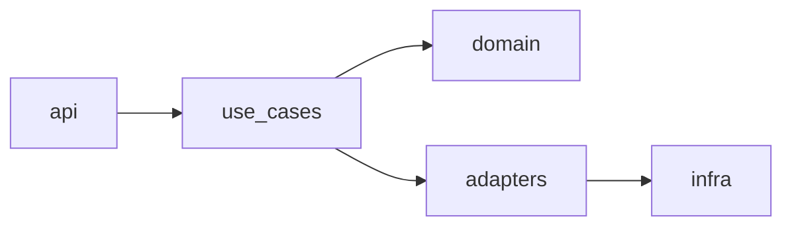

# Dependency Graph

_Generated: <YYYY-MM-DD>. Update when imports change or public functions appear / disappear._

## Module graph

High-level dependency between modules. Arrows go from importer to importee.

### Rules

- Dependencies point inward: `api → use_cases → domain`; `adapters → infra`.
- A cycle in this graph is a bug; resolve before merging.
- External libraries are not nodes here; list them in `Docs/STACK.md`.

## Function graph

For each module, one table.

### `<module-name>`

| Function | Inputs | Outputs | Calls | Called by | Notes |
|---|---|---|---|---|---|
| `<fn_name>` | `<param: Type>, <param: Type>` | `<ReturnType>` | `<other_fn>`, `<other_fn>` | `<caller_fn>` | Edge cases: `<list>` |

#### Conventions for the table

- **Inputs** and **Outputs** use the source-of-truth types (mypy / TS / Go / Rust signatures).
- **Calls** lists only first-party functions; standard library and external deps are omitted.
- **Called by** is empty for public entrypoints (API routes, CLI commands).
- **Notes** captures non-obvious edge cases: empty input handling, idempotency, side effects.

## How this file is maintained

1. Module graph: regenerate from the build system on every imports change (`pydeps`, `madge`, `go mod graph`, `cargo modules`).
2. Function graph: regenerate per module on every public-API change. Hand-edit the **Notes** column.
3. Commit message: `docs(dependency): refresh after <reason>`.

## Detecting drift

If `Docs/DEPENDENCY.md` was last touched > 14 days ago and `git log` shows code changes since, the graph is suspected stale. Surface this in code review.
